# Especificações do Projeto

A persona é o cliente ideal, sendo o arquétipo que reúne todas as características do melhor cliente. Ela é baseada em dados e características de clientes reais, como comportamento, dados demográficos, problemas, desafios e objetivos. Logo, estamos descrevendo o cliente que muito provavelmente irá procurar essa aplicação para realizar o gerenciamento de seu futebol semanal com amigos bem como os demais participantes, fixos ou esporádicos. Assim ao definir uma persona o foco deve ser entender o conflito ou problema a fim de determinar como a aplicação que será projetada poderá ajudá-lo.

## Personas

As personas levantadas neste projeto englobam as seguintes características:

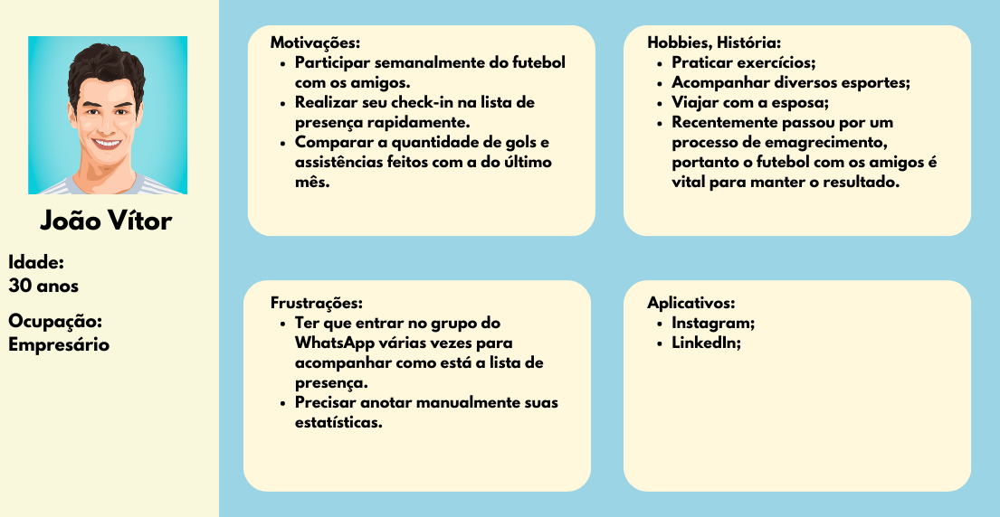
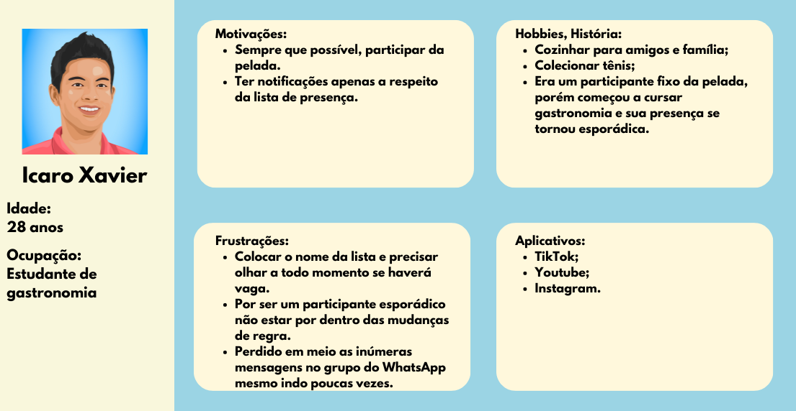
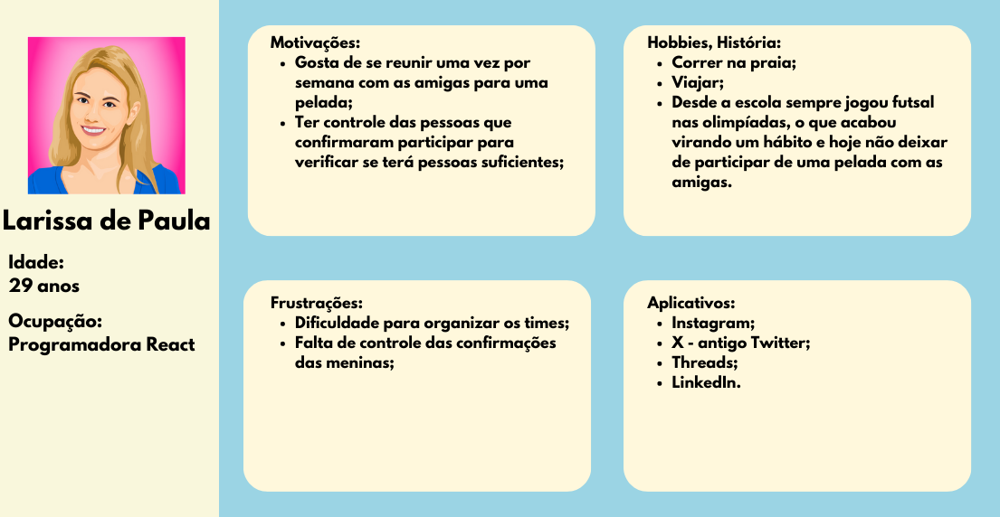

## Histórias de Usuários

Com base na análise das personas forma identificadas as seguintes histórias de usuários:

|EU COMO... `PERSONA`| QUERO/PRECISO ... `FUNCIONALIDADE`                   |PARA ... `MOTIVO/VALOR`                    |
|--------------------|------------------------------------------------------|-------------------------------------------|
|Vinícius Melo (Administrador)| Visualizar as presenças na lista semanal| Definir antecipadamente o quórum da semana|
|Vinícius Melo (Administrador)| Disponibilizar as informações de pagamento para os participantes| Padronizar e facilitar o pagamento |
|João Vitor (Participante fixo)| Marcar o tempo das partidas |Para que todos joguem igualmente|
|João Vitor (Participante fixo)| Avaliar o nível da partida da semana| Podermos ter uma média mensal, semestral e anual do nosso desempenho |
|Icaro Xavier (Participante esporádico)| Contabilizar meus gols em gol a cada semana| Definir metas e me desafiar a sempre melhorar minhas estatísticas|
|Icaro Xavier (Participante esporádico)|Um chat exclusivo para falarmos sobre a pelada da semana |Manter meu WhatsApp exclusivo para assuntos profissionais|
|Larissa de Paula (Quer administrar uma pelada)| Avisar todas minhas amigas que iremos ter futebol semanalmente | Para poder estabelecer uma pelada frequente|
|Larissa de Paula (Quer administrar uma pelada)| Confirmar a presença de todas que irão comparecer | Analisar a quantidade de pessoas para alugar a quadra de futebol.|

## Modelagem do Processo de Negócio 

### Análise da Situação Atual

Será apresentado abaixo, o exemplo real de um grupo de organização de pelada de futebol:

Na segunda-feira pela manhã, é aberta a lista de presença para a pelada da semana a ser realizada na quinta-feira. Existem 5 campos possíveis de preenchimento: 
- Linha: Destinado aos mensalistas, participantes fixos que pagam mensalidade e que possuem vaga cativa na semana, para colocarem seus nomes confirmando assim sua presença.
- Semimensalistas: Destinado àqueles que estão na lista de espera para virar mensalista. Estes pagam uma mensalidade inferior ao mensalista e possuem prioridade em caso de ausência de algum mensalista.
- Goleiros:  Duas vagas destinadas a interessados a ir durante toda peleja no gol. Participam gratuitamente.
- Ausentes: Destinado aos mensalistas para colocarem seus nomes em caso de ausência na semana.
- Avulsos: Destinado aos participantes esporádicos. Tem a última prioridade em caso de vagas livres. Estes pagam por dia que comparecem.

O problema deste modelo atual é a poluição e quantidade alta de mensagens no grupo, pois para cada confirmação a mensagem da lista é copiada reenviada com o nome acrescentado. Em uma semana em que todas as vagas são preenchidas e que existem confirmações, desconfirmações, alertas, avisos e lembretes são enviadas em média 80 a 100 mensagens.

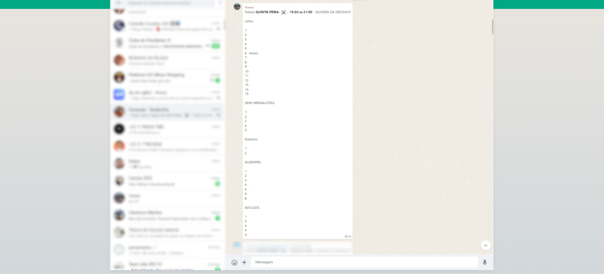

O prazo para os mensalistas se manifestarem é até às 17:00 da quarta-feira. Após este prazo a prioridade passa para os semimensalistas e caso sobrem vagas, para os avulsos. Muitas vezes, por motivos adversos, as pessoas não confirmam presença nem ausência e cabe ao administrador enviar lembretes no decorrer da semana cobrando posicionamentos. Estes lembretes somam-se ao grande número de mensagens.

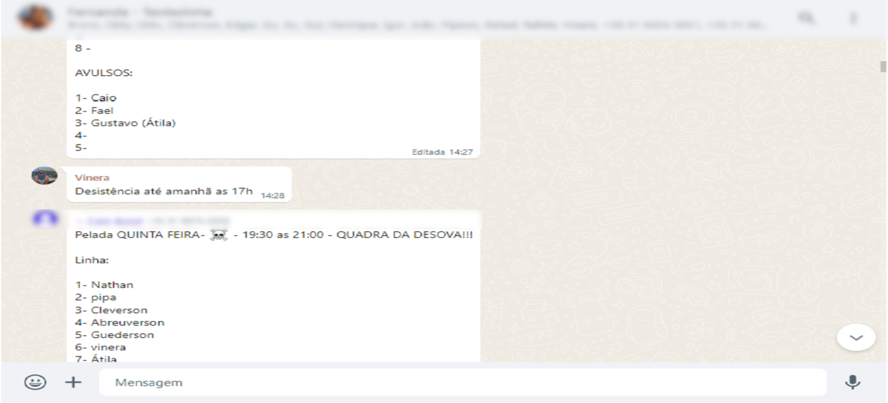
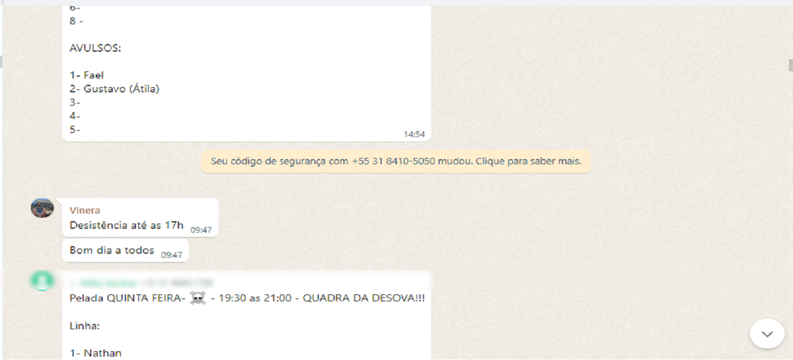

Além de cobrar dos participantes que se manifestem na lista de presença, o administrador ainda tem outra tarefa semanal. Cobrar os avulsos e os semimensalistas suas contribuições financeiras. Por diversos fatores, os pagamentos não são feitos na hora e cabe ao administrador posteriormente fazer a cobrança.

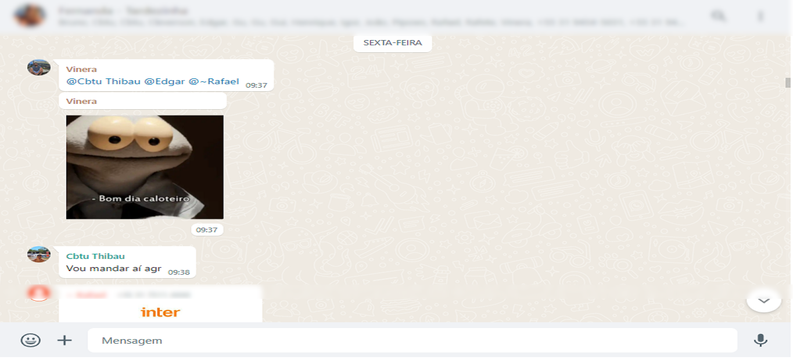

### Descrição Geral da Proposta

A proposta consiste em tornar o processo de gerenciamento de peladas semanais mais descentralizado e automatizado. Nos itens abaixo, estão expostos o mapeamento de processo atual e futuro.

### Processo AS IS – Gerenciar pelada semanal

O processo atual (AS IS) tem suas atividades descritas conforme o mapeamento abaixo. No entanto, foram observadas alguns oportunidades de melhoria, como por exemplo: atividades puramente manuais e centralizadas em uma única pessoa e alto fluxo de mensagens no grupo do Whastapp fazendo com que haja risco de perda de informações.

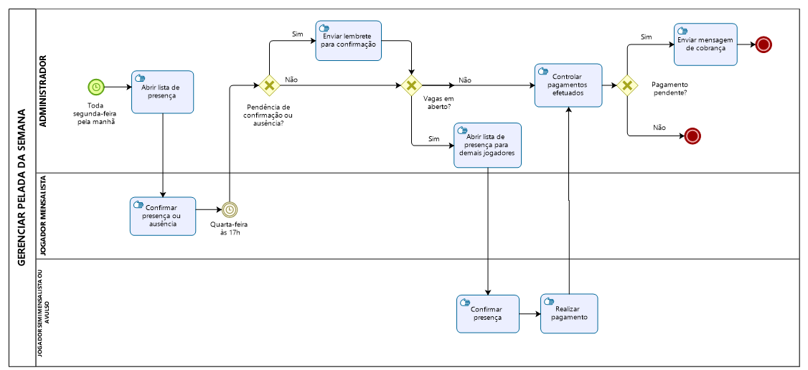

### Processo TO BE – Gerenciar pelada semanal

No processo futuro (TO BE), a maioria das atividades são semelhantes ao processo atual, no entanto, destaca-se que agora são feitas com suporte de uma aplicação que auxilia no gerenciamento adequado. Além disso, foram designadas atividades a serem feitas pela própria aplicação, independente da ação humana, tornando o processo mais automatizado. 

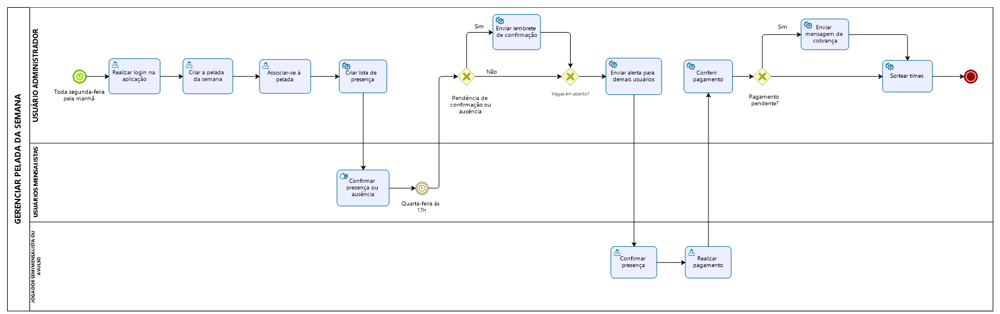

## Indicadores de Desempenho

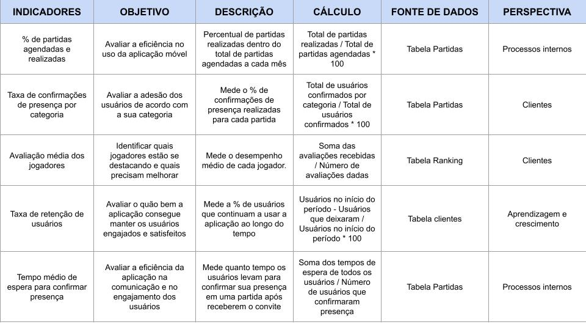
 

## Requisitos

O escopo funcional do projeto é definido por meio dos requisitos funcionais que descrevem as possibilidades de interação dos usuários, bem como os requisitos não funcionais que descrevem os aspectos que o sistema deverá apresentar de maneira geral. Estes requisitos são apresentados a seguir.

### Requisitos Funcionais

A tabela a seguir apresenta os requisitos do projeto, identificando a prioridade em que os mesmos devem ser entregues:

|ID    | Descrição do Requisito  | Prioridade |
|------|-----------------------------------------|----|
|RF-001| Permitir que o usuário cadastre-se. | ALTA | 
|RF-002| Permitir que o usuário crie sua pelada.   | ALTA |
|RF-003| Permitir que o usuário associe-se à uma pelada.   | ALTA |
|RF-004| Permitir que o usuário registre os gols da partida.  | ALTA |
|RF-005| Permitir que o usuário visualize a lista de presença.   | ALTA |
|RF-006| A aplicação deverá ter uma aba de resenha para a galera postar no aplicativo.   | MÉDIA |
|RF-007| A aplicação deverá cronometrar as partidas.   | MÉDIA |
|RF-008| A Aplicação deverá permitir que os usuários avaliem as partidas.   | MÉDIA |
|RF-009| A aplicação deverá informar aos semimensalistas e avulsos a chave PIX para pagamento. | ALTA |
|RF-010| A aplicação deverá permitir aos semimensalistas e avulsos informar o pagamento realizado.   | BAIXA |

### Requisitos não Funcionais

A tabela a seguir apresenta os requisitos não funcionais que o projeto deverá atender:

|ID     | Descrição do Requisito  |Prioridade |
|-------|-------------------------|----|
|RNF-001| O sistema deve ser responsivo para rodar em um dispositivos móveis | MÉDIA | 
|RNF-002|A aplicação deve ser publicada em um ambiente acessível publicamente na Internet (Repl.it, GitHub Pages, Heroku) |ALTA|
|RNF-003|A aplicação deve ter bom nível de contraste entre os elementos da tela em conformidade. | MÉDIA  | 
|RNF-004|A aplicação deve ser compatível com os principais sistemas operacionais do mercado (Android, iOS).  | ALTA  |
|RNF-005|A aplicação não deve permitir o recebimento de cadastros de usuários com dados necessários em branco.| BAIXA     |
|RNF-006|A aplicação deverá informar o erro de cadastro e login para o usuário caso os dados inseridos não estejam no banco de dados.|MÉDIA |
|RNF-007|A aplicação deverá realizar backup dos dados principais de cadastros dos clientes para um banco de dados em nuvem.               | ALTA |

## Restrições

O projeto está restrito pelos itens apresentados na tabela a seguir.

|ID| Restrição                                             |
|--|-------------------------------------------------------|
|RE-001|O projeto deverá ser entregue no final do semestre letivo, não podendo extrapolar a data de 07/12/2023. |
|RE-002|A equipe não pode subcontratar o desenvolvimento do trabalho.  |
|RE-003|A aplicação mobile não deve demandar pagamento.    | 

## Diagrama de Casos de Uso

O diagrama de casos de uso a seguir resume as interações dos atores com a aplicação:
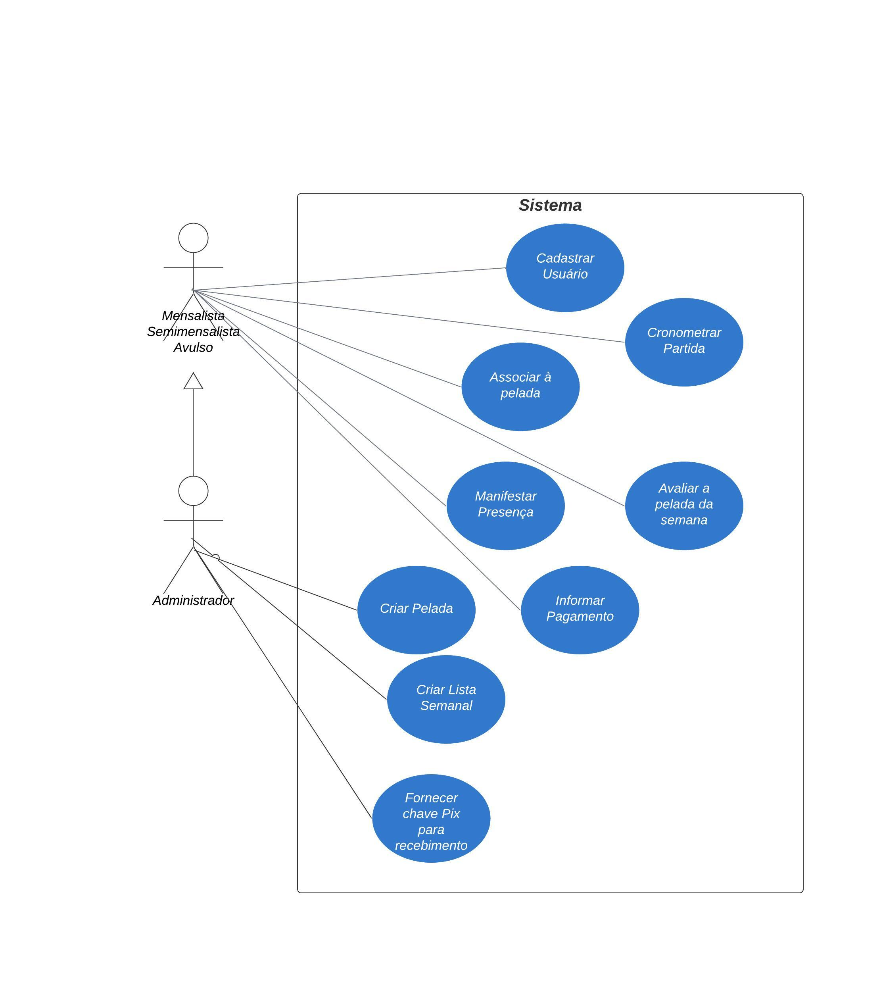

# Matriz de Rastreabilidade

A matriz de rastreabilidade é uma ferramenta usada para facilitar a visualização dos relacionamento entre requisitos e outros artefatos ou objetos, permitindo a rastreabilidade entre os requisitos e os objetivos de negócio. 

A matriz deve contemplar todos os elementos relevantes que fazem parte do sistema, conforme a figura meramente ilustrativa apresentada a seguir.

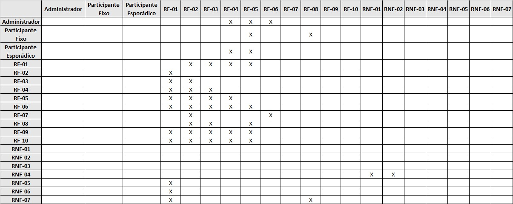

# Gerenciamento de Projeto

O Gerenciamento de Projeto envolve a aplicação de conhecimentos, habilidades, ferramentas e técnicas nas atividades do projeto para atender aos seus requisitos. Ele abrange a iniciação, planejamento, execução, monitoramento e controle e encerramento de um projeto. O objetivo principal é concluir o projeto conforme o escopo definido, no tempo estipulado e dentro do orçamento previsto, atendendo às expectativas das partes interessadas. Com isso foi projetado um planejamento com o Gerenciamento de Tempo, Gerenciamento de Equipe e Gestão do Orçamento para garantir entrega do produto final.

## Gerenciamento de Tempo

O Gerenciamento de Tempo refere-se ao processo de organizar e planejar a divisão do tempo entre atividades específicas. No contexto de projetos, envolve a identificação de todas as tarefas necessárias, a duração estimada para cada uma delas e a sequência adequada para execução. Assim, foi projetado um board do tipo Roadmap, através da ferramenta de Projetos do Github para acompanhamento das tarefas definidas dentro das Sprints, garantindo um bom gerenciamento de tempo e que o projeto seja concluído dentro do prazo definido.

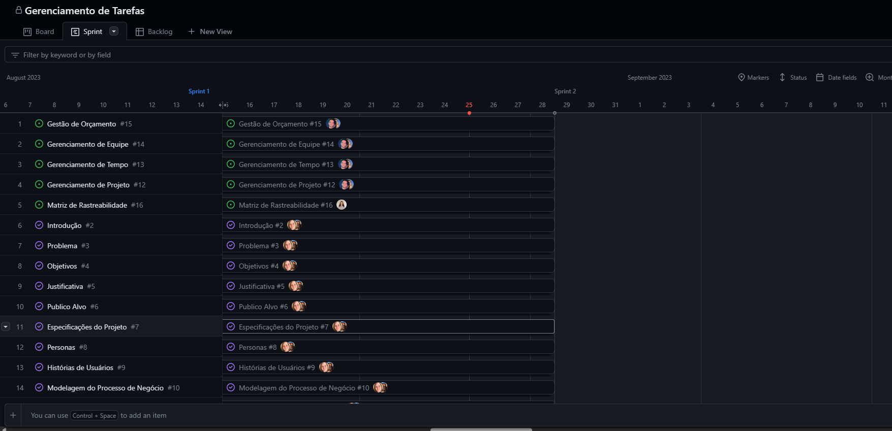

## Gerenciamento de Equipe

O gerenciamento adequado de tarefas contribuirá para que o projeto alcance altos níveis de produtividade. Por isso, é fundamental que ocorra a gestão de tarefas e de pessoas, de modo que os times envolvidos no projeto possam ser facilmente gerenciados. 

## Gestão de Orçamento

A gestão de orçamento diz respeito à previsão, alocação e controle dos custos do projeto. Inicia-se com a elaboração de um orçamento detalhado, baseado nas necessidades do projeto e nos recursos disponíveis. Foi desenvolvido para o projeto uma estimativa variável com os custos médios do projeto.

Foi especificado com base no site Glassdoor.com uma média de salarios mensais para estimar os custos:
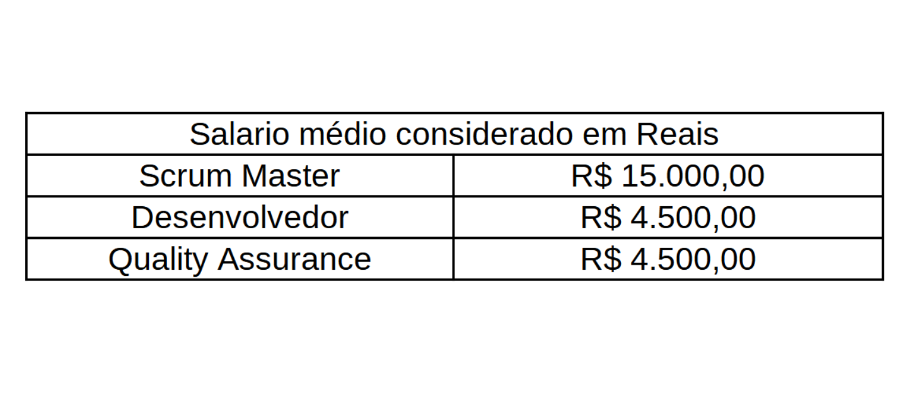

Assim foi projetado a estimativa de custos finais do Projeto com duração de 5 meses, onde a equipe conta com um Scrum Master, um Quality Assurance, e três Desenvolvedores: 
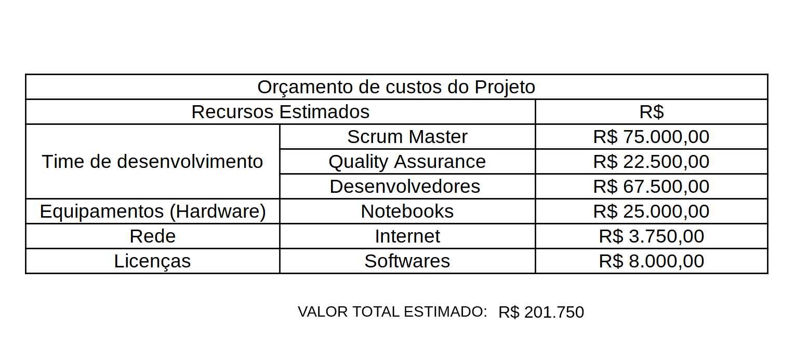

