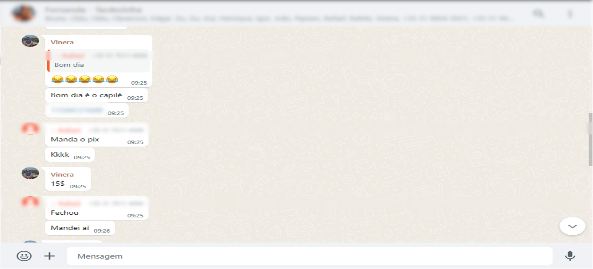

# Especificações do Projeto

A persona é o cliente ideal, sendo o arquétipo que reúne todas as características do melhor cliente. Ela é baseada em dados e características de clientes reais, como comportamento, dados demográficos, problemas, desafios e objetivos. Logo, estamos descrevendo o cliente que muito provavelmente irá procurar essa aplicação para realizar o gerenciamento de seu futebol semanal com amigos bem como os demais participantes, fixos ou esporádicos. Assim ao definir uma persona o foco deve ser entender o conflito ou problema a fim de determinar como a aplicação que será projetada poderá ajudá-lo.

## Personas

As personas levantadas neste projeto englobam as seguintes características:

## Histórias de Usuários

Com base na análise das personas forma identificadas as seguintes histórias de usuários:

|EU COMO... `PERSONA`| QUERO/PRECISO ... `FUNCIONALIDADE`                   |PARA ... `MOTIVO/VALOR`                    |
|--------------------|------------------------------------------------------|-------------------------------------------|
|Vinícius Melo (Administrador)| Automatizar as presenças e ausências na lista semanal| Definir antecipadamente o quórum da semana|
|Vinícius Melo (Administrador)| Sortear os times com os nomes dos participantes da semana| Não perdermos tempo tirando o time na hora da pelada|
|Vinícius Melo (Administrador)| Disponibilizar as informações de pagamento para os participantes| Padronizar e facilitar o pagamento |
|João Vitor (Participante fixo)| Realizar meu check-in com "um clique"|Não comprometer minhas tarefas profissionais|
|João Vitor (Participante fixo)| Contabilizar minhas participações em gol a cada semana| Definir metas e me desafiar a sempre melhorar minhas estatísticas|
|Icaro Xavier (Participante esporádico)| Visualizar a lista de presença facilmente| Programar-me ao sair de casa de manhã sabendo se levarei ou não a mochila com os equipamentos |
|Icaro Xavier (Participante esporádico)|Informações rápidas e objetivas |Não receber inúmeras notificações de WhatsApp redundantes e que não me dizem respeito|

## Modelagem do Processo de Negócio 

### Análise da Situação Atual

Será apresentado abaixo, o exemplo real de um grupo de organização de pelada de futebol:

Na segunda-feira pela manhã, é aberta a lista de presença para a pelada da semana a ser realizada na quinta-feira. Existem 5 campos possíveis de preenchimento: 
- Linha: Destinado aos mensalistas, participantes fixos que pagam mensalidade e que possuem vaga cativa na semana, para colocarem seus nomes confirmando assim sua presença.
- Semimensalistas: Destinado àqueles que estão na lista de espera para virar mensalista. Estes pagam uma mensalidade inferior ao mensalista e possuem prioridade em caso de ausência de algum mensalista.
- Goleiros:  Duas vagas destinadas a interessados a ir durante toda peleja no gol. Participam gratuitamente.
- Ausentes: Destinado aos mensalistas para colocarem seus nomes em caso de ausência na semana.
- Avulsos Destinado aos participantes esporádicos. Tem a última prioridade em caso de vagas livres. Estes pagam por dia que comparecem.

O problema deste modelo atual é a poluição e quantidade alta de mensagens no grupo, pois para cada confirmação a mensagem da lista é copiada reenviada com o nome acrescentado. Em uma semana em que todas as vagas são preenchidas e que existem confirmações, desconfirmações, alertas, avisos e lembretes são enviadas em média 80 a 100 mensagens.

O prazo para os mensalistas se manifestarem é até às 17:00 da quarta-feira. Após este prazo a prioridade passa para os semimensalistas e caso sobrem vagas, para os avulsos. Muitas vezes, por motivos adversos, as pessoas não confirmam presença nem ausência e cabe ao administrador enviar lembretes no decorrer da semana cobrando posicionamentos. Estes lembretes somam-se ao grande número de mensagens.

Além de cobrar dos participantes que se manifestem na lista de presença, o administrador ainda tem outra tarefa semanal. Cobrar os avulsos e os semimensalistas suas contribuições financeiras. Por diversos fatores, os pagamentos não são feitos na hora e cabe ao administrador posteriormente fazer a cobrança.

### Descrição Geral da Proposta

Apresente aqui uma descrição da sua proposta abordando seus limites e suas ligações com as estratégias e objetivos do negócio. Apresente aqui as oportunidades de melhorias.

### Processo 1 – NOME DO PROCESSO

Apresente aqui o nome e as oportunidades de melhorias para o processo 1. Em seguida, apresente o modelo do processo 1, descrito no padrão BPMN. 

### Processo 2 – NOME DO PROCESSO

Apresente aqui o nome e as oportunidades de melhorias para o processo 2. Em seguida, apresente o modelo do processo 2, descrito no padrão BPMN.

## Indicadores de Desempenho

Apresente aqui os principais indicadores de desempenho e algumas metas para o processo. Atenção: as informações necessárias para gerar os indicadores devem estar contempladas no diagrama de classe. Colocar no mínimo 5 indicadores. 

Usar o seguinte modelo: 

Obs.: todas as informações para gerar os indicadores devem estar no diagrama de classe a ser apresentado a posteriori. 

## Requisitos

O escopo funcional do projeto é definido por meio dos requisitos funcionais que descrevem as possibilidades de interação dos usuários, bem como os requisitos não funcionais que descrevem os aspectos que o sistema deverá apresentar de maneira geral. Estes requisitos são apresentados a seguir.

### Requisitos Funcionais

A tabela a seguir apresenta os requisitos do projeto, identificando a prioridade em que os mesmos devem ser entregues:

|ID    | Descrição do Requisito  | Prioridade |
|------|-----------------------------------------|----|
|RF-001| Permitir que o usuário cadastre-se. | ALTA | 
|RF-002| Permitir que o usuário crie sua pelada.   | ALTA |
|RF-003| Permitir que o usuário associe-se à uma pelada.   | ALTA |
|RF-004| Permitir que o usuário crie a lista de presença semanal.  | ALTA |
|RF-005| Permitir que o usuário manifeste sua presença ou ausência na lista semanal.   | ALTA |
|RF-006| A aplicação deverá sortear os times com base nos participantes da lista semanal.   | MÉDIA |
|RF-007| A aplicação deverá cronometrar as partidas.   | MÉDIA |
|RF-008| A aplicação deverá armazenar as estatísticas dos marcadores e assistentes da partida.   | MÉDIA |
|RF-009| A aplicação deverá informar aos semimensalistas e avulsos a chave PIX para pagamento. | ALTA |
|RF-010| A aplicação deverá permitir aos semimensalistas e avulsos informar o pagamento realizado.   | BAIXA |

### Requisitos não Funcionais

A tabela a seguir apresenta os requisitos não funcionais que o projeto deverá atender:

|ID     | Descrição do Requisito  |Prioridade |
|-------|-------------------------|----|
|RNF-001| O sistema deve ser responsivo para rodar em um dispositivos móveis | MÉDIA | 
|RNF-002|A aplicação deve ser publicada em um ambiente acessível publicamente na Internet (Repl.it, GitHub Pages, Heroku) |ALTA|
|RNF-003|A aplicação deve ter bom nível de contraste entre os elementos da tela em conformidade. | MÉDIA  | 
|RNF-004|A aplicação deve ser compatível com os principais sistemas operacionais do mercado (Android, iOS).  | ALTA  |
|RNF-005|A aplicação não deve permitir o recebimento de cadastros de usuários com dados necessários em branco.| BAIXA     |
|RNF-006|A aplicação deverá informar o erro de cadastro e login para o usuário caso os dados inseridos não estejam no banco de dados.|MÉDIA |
|RNF-007|A aplicação deverá realizar backup dos dados principais de cadastros dos clientes para um banco de dados em nuvem.               | ALTA |

## Restrições

O projeto está restrito pelos itens apresentados na tabela a seguir.

|ID| Restrição                                             |
|--|-------------------------------------------------------|
|RE-001|O projeto deverá ser entregue no final do semestre letivo, não podendo extrapolar a data de 07/12/2023. |
|RE-002|A equipe não pode subcontratar o desenvolvimento do trabalho.  |
|RE-003|A aplicação mobile não deve demandar pagamento.    | 

## Diagrama de Casos de Uso

O diagrama de casos de uso é o próximo passo após a elicitação de requisitos, que utiliza um modelo gráfico e uma tabela com as descrições sucintas dos casos de uso e dos atores. Ele contempla a fronteira do sistema e o detalhamento dos requisitos funcionais com a indicação dos atores, casos de uso e seus relacionamentos. 

As referências abaixo irão auxiliá-lo na geração do artefato “Diagrama de Casos de Uso”.

> **Links Úteis**:
> - [Criando Casos de Uso](https://www.ibm.com/docs/pt-br/elm/6.0?topic=requirements-creating-use-cases)
> - [Como Criar Diagrama de Caso de Uso: Tutorial Passo a Passo](https://gitmind.com/pt/fazer-diagrama-de-caso-uso.html/)
> - [Lucidchart](https://www.lucidchart.com/)
> - [Astah](https://astah.net/)
> - [Diagrams](https://app.diagrams.net/)

# Matriz de Rastreabilidade

A matriz de rastreabilidade é uma ferramenta usada para facilitar a visualização dos relacionamento entre requisitos e outros artefatos ou objetos, permitindo a rastreabilidade entre os requisitos e os objetivos de negócio. 

A matriz deve contemplar todos os elementos relevantes que fazem parte do sistema, conforme a figura meramente ilustrativa apresentada a seguir.

> **Links Úteis**:
> - [Artigo Engenharia de Software 13 - Rastreabilidade](https://www.devmedia.com.br/artigo-engenharia-de-software-13-rastreabilidade/12822/)
> - [Verificação da rastreabilidade de requisitos usando a integração do IBM Rational RequisitePro e do IBM ClearQuest Test Manager](https://developer.ibm.com/br/tutorials/requirementstraceabilityverificationusingrrpandcctm/)
> - [IBM Engineering Lifecycle Optimization – Publishing](https://www.ibm.com/br-pt/products/engineering-lifecycle-optimization/publishing/)

# Gerenciamento de Projeto

De acordo com o PMBoK v6 as dez áreas que constituem os pilares para gerenciar projetos, e que caracterizam a multidisciplinaridade envolvida, são: Integração, Escopo, Cronograma (Tempo), Custos, Qualidade, Recursos, Comunicações, Riscos, Aquisições, Partes Interessadas. Para desenvolver projetos um profissional deve se preocupar em gerenciar todas essas dez áreas. Elas se complementam e se relacionam, de tal forma que não se deve apenas examinar uma área de forma estanque. É preciso considerar, por exemplo, que as áreas de Escopo, Cronograma e Custos estão muito relacionadas. Assim, se eu amplio o escopo de um projeto eu posso afetar seu cronograma e seus custos.

## Gerenciamento de Tempo

Com diagramas bem organizados que permitem gerenciar o tempo nos projetos, o gerente de projetos agenda e coordena tarefas dentro de um projeto para estimar o tempo necessário de conclusão.

O gráfico de Gantt ou diagrama de Gantt também é uma ferramenta visual utilizada para controlar e gerenciar o cronograma de atividades de um projeto. Com ele, é possível listar tudo que precisa ser feito para colocar o projeto em prática, dividir em atividades e estimar o tempo necessário para executá-las.

## Gerenciamento de Equipe

O gerenciamento adequado de tarefas contribuirá para que o projeto alcance altos níveis de produtividade. Por isso, é fundamental que ocorra a gestão de tarefas e de pessoas, de modo que os times envolvidos no projeto possam ser facilmente gerenciados. 

## Gestão de Orçamento

O processo de determinar o orçamento do projeto é uma tarefa que depende, além dos produtos (saídas) dos processos anteriores do gerenciamento de custos, também de produtos oferecidos por outros processos de gerenciamento, como o escopo e o tempo.

