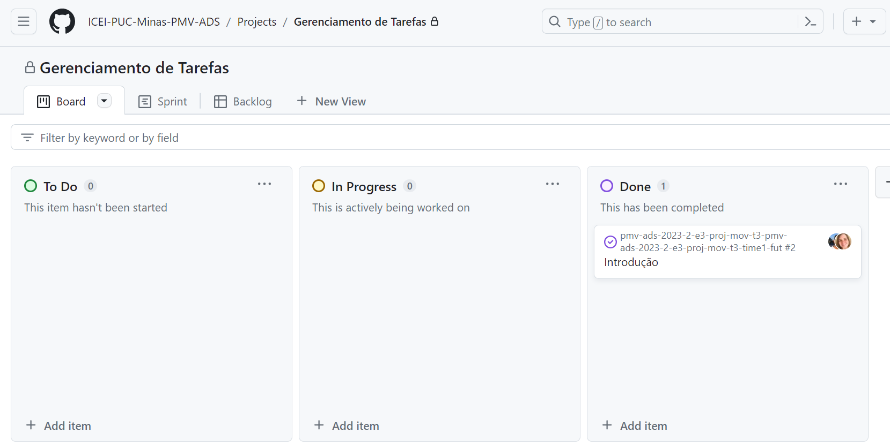

# Metodologia

Os artefatos do projeto serão desenvolvidos a partir das plataformas listadas abaixo:

|Ambiente                       |Plataforma  |Link de acesso                                                                                                          |
|---------------------------    |----------  |------------------------------------------------------------------------------------------------------------------------|
|Repositório de código-fonte    |GitHub      |[GitHub](https://github.com/ICEI-PUC-Minas-PMV-ADS/pmv-ads-2023-2-e3-proj-mov-t3-pmv-ads-2023-2-e3-proj-mov-t3-time1-fut/tree/main)|
|Documentos do projeto          |GitHub|[GitHub](https://github.com/ICEI-PUC-Minas-PMV-ADS/pmv-ads-2023-2-e3-proj-mov-t3-pmv-ads-2023-2-e3-proj-mov-t3-time1-fut/tree/main/docs)                               | 
|Gerenciamento do projeto       | GitHub    |[GitHub](https://github.com/orgs/ICEI-PUC-Minas-PMV-ADS/projects/489)                               |
|Gerenciamento de diagramas     |brModelo |[brModelo](xxxxxxx)                                                    | 
|Gerenciamento de wireframes    |InvisionApp|[InvisionApp](https://leticiapauli122925.invisionapp.com/freehand/AppFut-FA7MzIBsS)                       | 
|Gerenciamento do banco de dados|Firebase| [Firebase](xxxxxxxxx)                                                                             |
|Gerenciamento de código-fonte|GitHub|    [GitHub](https://github.com/ICEI-PUC-Minas-PMV-ADS/pmv-ads-2023-2-e3-proj-mov-t3-pmv-ads-2023-2-e3-proj-mov-t3-time1-fut/tree/main)                                                                                                                |
|Serviço de hospedagem da aplicação|localhost|[localhost](xxxxxx)                                                         |
 
 

## Controle de Versão

A ferramenta de controle de versão adotada no projeto foi o
[Git](https://git-scm.com/), sendo que o [Github](https://github.com)
foi utilizado para hospedagem do repositório.

O projeto segue a seguinte convenção para o nome de branches:

- `main`: versão estável já testada do software
- `unstable`: versão já testada do software, porém instável
- `testing`: versão em testes do software
- `dev`: versão de desenvolvimento do software

Quanto à gerência de issues, o projeto adota a seguinte convenção para
etiquetas:

- `documentation`: melhorias ou acréscimos à documentação
- `bug`: uma funcionalidade encontra-se com problemas
- `enhancement`: uma funcionalidade precisa ser melhorada
- `feature`: uma nova funcionalidade precisa ser introduzida

## Gerenciamento de Projeto

### Divisão de Papéis
No tocante à dinâmica de organização da equipe, é preconizada a realização de duas reuniões por semana entre os membros da equipe, e uma reunião por semana com o professor orientador para apresentação  das entregas, com avaliação e possíveis indicações de ajustes a serem executados, além das orientações para as entregas da semana seguinte. As reuniões são organizadas na seguinte forma:
1. Reunião semanal com o Professor orientador, sempre às terças-feiras às 19h na plataforma Teams e gravadas sempre que necessário.
2. Reunião entre os membros da equipe, ordinariamente às quartas-feiras às 16:00 na plataforma Teams. Nesta reunião são discutidos os possíveis ajustes apontados pelo Professor na reunião 1, bem como a divisão de tarefas para a próxima entrega.
3. Reunião entre os membros da equipe, ordinariamente às segundas-feiras às 16:00 na plataforma Teams. Nesta reunião são apresentadas as produções definidas na reunião 2 e feitos os ajustes necessários para a entrega da semana. 

Quanto ao gerenciamento do projeto, foram criados quadros Kanban na ferramenta XXXXX referentes a cada sprint semanal, transformando o trabalho em andamento visível para toda a equipe, criando um sinal visual que indica que a nova atividade pode ou não ser iniciada e se o prazo acordado está sendo seguido. 
Para organização e distribuição das atividades do projeto, o XXXXX foi estruturado com as seguintes listas:

- Backlog: atividades a serem trabalhadas;
- To Do: atividades da sprint atual;
- Doing: atividades iniciadas e que ainda sem conclusão;
- Done: atividades executadas e prontas para entrega.
 

Apresente a divisão de papéis entre os membros do grupo.

Exemplificação: A equipe utiliza metodologias ágeis, tendo escolhido o Scrum como base para definição do processo de desenvolvimento. A equipe está organizada da seguinte maneira:
- Scrum Master: Douglas Zoccarato Gomes;
- Product Owner: Lia Araruna de Lima;
- Equipe de Desenvolvimento: Leticia Layane Pauli, Matheus Araujo Rios Fernandino;
- Equipe de Design: Matheus Leão.

### Processo

Coloque  informações sobre detalhes da implementação do Scrum seguido pelo grupo. O grupo deverá fazer uso do recurso de gerenciamento de projeto oferecido pelo GitHub, que permite acompanhar o andamento do projeto, a execução das tarefas e o status de desenvolvimento da solução.
 

### Ferramentas

As ferramentas empregadas no projeto são:

- Editor de código.
- Ferramentas de comunicação
- Ferramentas de desenho de tela (_wireframing_)

O editor de código foi escolhido porque ele possui uma integração com o sistema de versão. As ferramentas de comunicação utilizadas possuem integração semelhante e por isso foram selecionadas. Por fim, para criar diagramas utilizamos essa ferramenta por melhor captar as necessidades da nossa solução.
 
