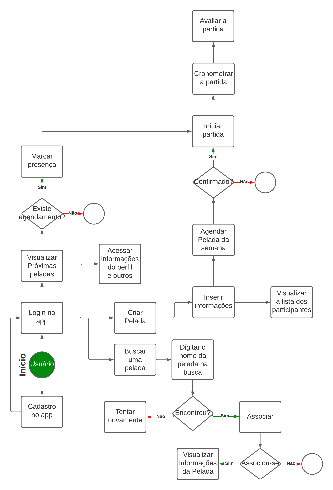
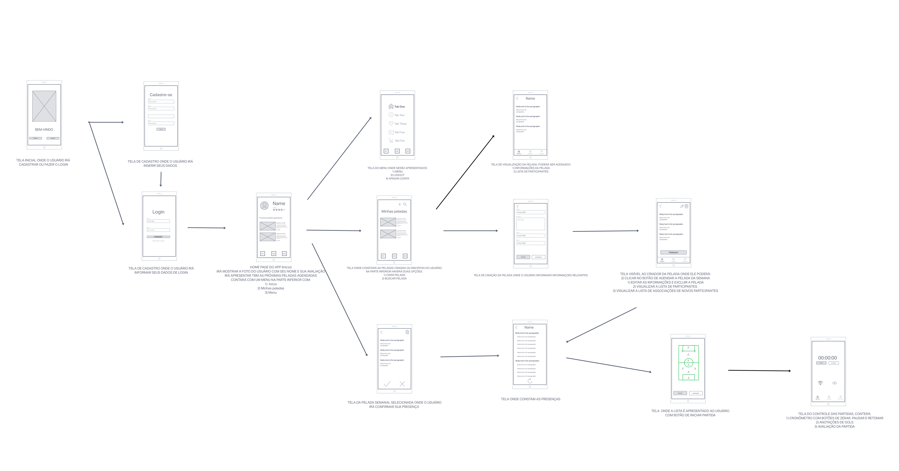

# Projeto de Interface

## Diagrama de Fluxo

O diagrama de fluxo a seguir apresenta a interação do usuário com o sistema interativo da aplicação mobile. O diagrama de fluxo foi desenvolvido com “boxes” que possuem internamente a indicação dos principais elementos de interface.

## Wireframes

Foram prototipadas as telas da aplicação móvel, conforme fluxo de funcionalidades apresentadas no item anterior. Estes protótipos tem a função de sugerir a estrutura da aplicação móvel e os relacionamentos entre suas páginas.

