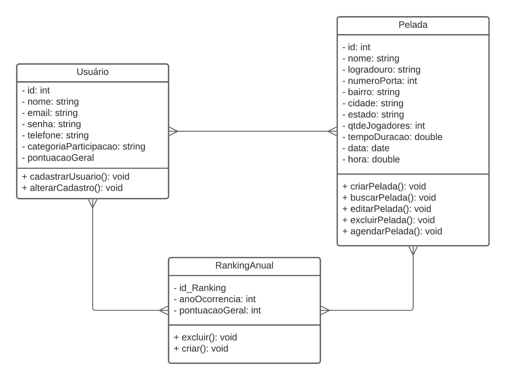
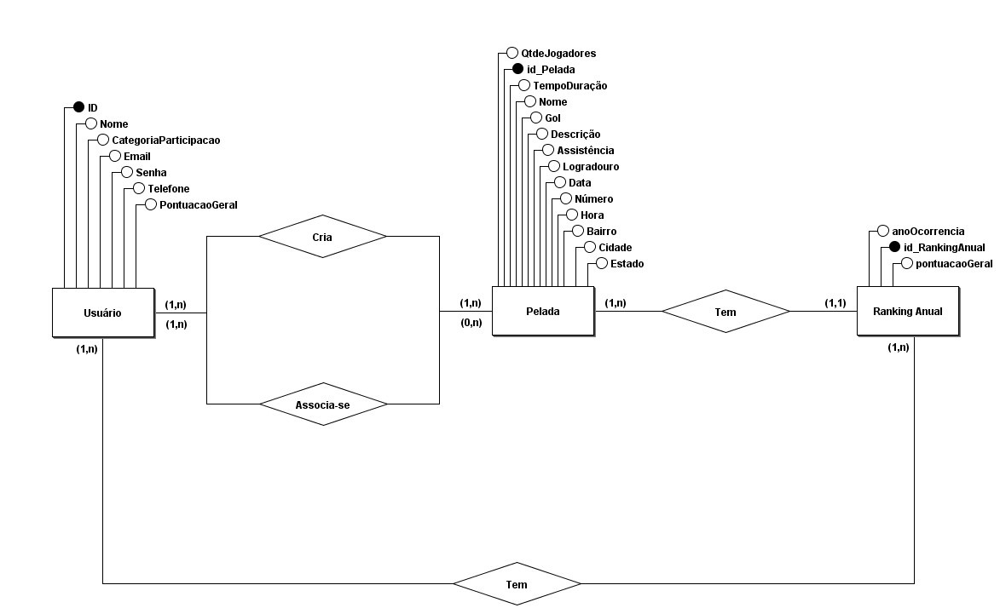
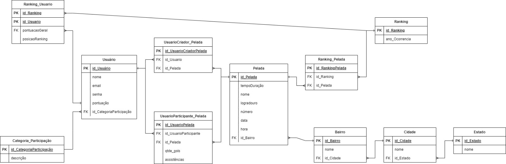
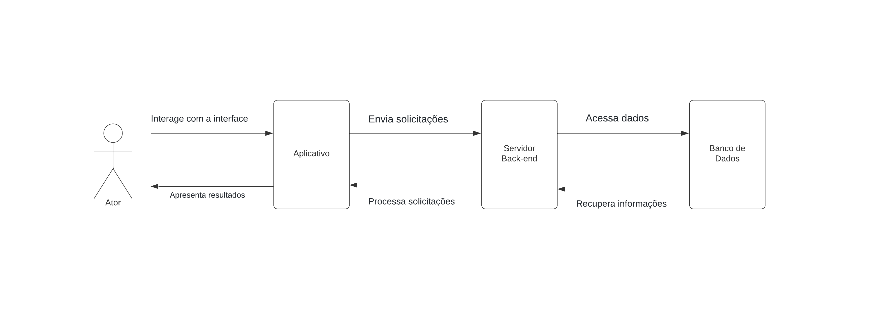

# Arquitetura da Solução

<span style="color:red">Pré-requisitos: <a href="3-Projeto de Interface.md"> Projeto de Interface</a></span>

Definição de como o software é estruturado em termos dos componentes que fazem parte da solução e do ambiente de hospedagem da aplicação.


## Diagrama de Classes

O diagrama de classes ilustra graficamente como será a estrutura do software, e como cada uma das classes da sua estrutura estarão interligadas. Essas classes servem de modelo para materializar os objetos que executarão na memória.



## Modelo ER

O Modelo ER representa através de um diagrama como as entidades (coisas, objetos) se relacionam entre si na aplicação interativa.



## Esquema Relacional

O Esquema Relacional corresponde à representação dos dados em tabelas juntamente com as restrições de integridade e chave primária.
 



## Modelo Físico

Entregar um arquivo banco.sql contendo os scripts de criação das tabelas do banco de dados. Este arquivo deverá ser incluído dentro da pasta src\bd.

```
-- Tabela USUARIO
CREATE TABLE USUARIO (
    id_usuario INT NOT NULL PRIMARY KEY AUTO_INCREMENT,
    nome VARCHAR(50) NOT NULL,
    email VARCHAR(50) NOT NULL,
    senha VARCHAR(10) NOT NULL,
    pontuacao INT,
    id_categoriaParticipacao INT,
    FOREIGN KEY (id_categoriaParticipacao) REFERENCES CATEGORIA_PARTICIPACAO(id_categoriaParticipacao)
);

-- Tabela CATEGORIA_PARTICIPACAO
CREATE TABLE CATEGORIA_PARTICIPACAO (
    id_categoriaParticipacao INT NOT NULL PRIMARY KEY AUTO_INCREMENT,
    descricao VARCHAR(100) NOT NULL
);

-- Tabela USUARIOCRIADOR_PELADA
CREATE TABLE USUARIOCRIADOR_PELADA (
    id_UsuarioCriadorPelada INT NOT NULL PRIMARY KEY AUTO_INCREMENT,
    id_Usuario INT NOT NULL,
    id_Pelada INT NOT NULL,
    FOREIGN KEY (id_Usuario) REFERENCES USUARIO(id_usuario),
    FOREIGN KEY (id_Pelada) REFERENCES PELADA(id_Pelada)
);

-- Tabela USUARIOPARTICIPANTE_PELADA
CREATE TABLE USUARIOPARTICIPANTE_PELADA (
    id_UsuarioPelada INT NOT NULL PRIMARY KEY AUTO_INCREMENT,
    id_UsuarioParticipante INT NOT NULL,
    id_Pelada INT NOT NULL,
    qtde_gols INT,
    qtde_assistencias INT,
    FOREIGN KEY (id_UsuarioParticipante) REFERENCES USUARIO(id_usuario),
    FOREIGN KEY (id_Pelada) REFERENCES PELADA(id_Pelada)
);

-- Tabela PELADA
CREATE TABLE PELADA (
    id_Pelada INT NOT NULL PRIMARY KEY AUTO_INCREMENT,
    tempoDuracao DOUBLE NOT NULL,
    nome VARCHAR(50) NOT NULL,
    logradouro VARCHAR(100) NOT NULL,
    numeroPorta INT NOT NULL,
    bairro VARCHAR(50) NOT NULL,
    cidade VARCHAR(50) NOT NULL,
    estado VARCHAR(50) NOT NULL,
    qtdeJogadores INT NOT NULL,
    data DATE,
    hora DOUBLE,
    id_Bairro INT NOT NULL,
    FOREIGN KEY (id_Bairro) REFERENCES BAIRRO(id_Bairro)
);

-- Tabela BAIRRO
CREATE TABLE BAIRRO (
    id_Bairro INT NOT NULL PRIMARY KEY AUTO_INCREMENT,
    nome VARCHAR(50) NOT NULL,
    id_Cidade INT,
    FOREIGN KEY (id_Cidade) REFERENCES CIDADE(id_Cidade)
);

-- Tabela CIDADE
CREATE TABLE CIDADE (
    id_Cidade INT NOT NULL PRIMARY KEY AUTO_INCREMENT,
    nome VARCHAR(50) NOT NULL,
    id_Estado INT NOT NULL,
    FOREIGN KEY (id_Estado) REFERENCES ESTADO(id_Estado)
);

-- Tabela ESTADO
CREATE TABLE ESTADO (
    id_Estado INT NOT NULL PRIMARY KEY AUTO_INCREMENT,
    nome VARCHAR(50)
);

-- Tabela RANKING_PELADA
CREATE TABLE RANKING_PELADA (
    id_RankingPelada INT NOT NULL PRIMARY KEY AUTO_INCREMENT,
    id_Ranking INT NOT NULL,
    id_Pelada INT NOT NULL,
    FOREIGN KEY (id_Ranking) REFERENCES RANKING(id_Ranking),
    FOREIGN KEY (id_Pelada) REFERENCES PELADA(id_Pelada)
);

-- Tabela RANKING
CREATE TABLE RANKING (
    id_Ranking INT NOT NULL PRIMARY KEY AUTO_INCREMENT,
    ano_Ocorrencia INT NOT NULL
);

-- Tabela RANKING_USUARIO
CREATE TABLE RANKING_USUARIO (
    id_RankingUsuario INT NOT NULL PRIMARY KEY AUTO_INCREMENT,
    id_Usuario INT NOT NULL,
    pontuacaoGeral INT,
    posicaoRanking INT NOT NULL,
    FOREIGN KEY (id_Usuario) REFERENCES USUARIO(id_usuario),
    FOREIGN KEY (pontuacaoGeral) REFERENCES USUARIO(pontuacao),
    FOREIGN KEY (id_Ranking) REFERENCES RANKING(id_Ranking)
);
```

## Tecnologias Utilizadas

|TECNOLOGIA|FERRAMENTA|
|----------|----------|
|Linguagem de Programação| React Native           |
|Banco de Dados          | Firebase               |
|Autenticação            | Firebase authentication|
|IDE de Desenvolvimento  | Visual Studio Code     |
|Framework               | React Native           |
|Prototipagem            | InVision               |




## Hospedagem

A aplicação mobile será executada em localhost.

## Qualidade de Software

Com o objetivo de avaliar a qualidade do software desenvolvido, as seguintes características e subcaracterísticas da ISO/IEC 25010 foram selecionadas como parâmetros para o projeto:

### 1- ADEQUAÇÃO FUNCIONAL: 
Essa característica se refere à capacidade do software de realizar o que se propõe a fazer.

1.1) Integridade funcional: cobertura de todas as tarefas e objetivos.


### 2- EFICIÊNCIA DE DESEMPENHO: 
Esse atributo está relacionado à performance do software.

2.1) Comportamento temporal: tempo de resposta e processamento.

Nessa etapa, espera-se que o aplicativo possua um tempo de resposta e processamento aceitável, sem que o usuário precise esperar muito tempo para realizar suas ações.

### 3- COMPATIBILIDADE: 
É a capacidade do produto ou do sistema de trocar informações, assim como de realizar funções enquanto compartilha um hardware.

3.1) Coexistência: capacidade de realizar funções eficientemente enquanto compartilha um ambiente ou recursos com outros produtos.

Essa característica e a subcaracterística serão importantes para identificar se a utilização do aplicativo pode se dar em paralelo com outras atividades do sistema.

### 4- USABILIDADE: 
É a capacidade do sistema realizar objetivos eficientemente, efetivamente e de maneira satisfatória.

4.1) Capacidade de aprendizado: facilidade de aprender como utilizar o sistema;

4.2) Proteção de erro do usuário: capacidade do produto proteger o usuário de erros. O aplicativo deve ser o mais intuitivo possível e também possuir informações explícitas onde possa encontrar alguma dificuldade;
4.3 - Estética da interface de usuário: agradabilidade da interface;

4.3) Estética da interface de usuário: agradabilidade da interface;

4.4) Acessibilidade: capacidade do sistema ser utilizado por pessoas com características e capacidades diversas.

### 5- CONFIABILIDADE: 
O quão bem o produto realiza funções específicas sob condições específicas.

5.1) Maturidade: capacidade do produto atingir as necessidades de confiabilidade;

5.2) Disponibilidade: Se o sistema está acessível e operante.

### 6- SEGURANÇA: 
Capacidade do sistema proteger informação e dados vulneráveis.

6.1) Confidencialidade: sistema tem que ser capaz de garantir que dados são acessados apenas por aqueles que tem acesso autorizado;

6.2) Integridade: capacidade de prevenir acesso não-autorizado e modificação de dados ou programas de computador.

### 7- MANUTENIBILIDADE: 
É a característica que engloba a capacidade de um sistema ser modificado, atualizado e adaptado às mudanças de ambiente e requerimentos.

7.1) Modularidade: o sistema pode sofrer mudanças sem impactar em outros componentes;

7.2) Reusabilidade: capacidade de um recurso poder ser utilizado em mais de um sistema;

7.3) Modificabilidade: capacidade do sistema ser modificado sem introduzir defeitos ou diminuir a qualidade do atual;

7.4) Testabilidade: efetividade de testes para o sistema.

### 8- PORTABILIDADE:  
Capacidade do sistema ser transferido de um ambiente para outro.

8.1) Facilidade de instalação: capacidade do sistema ser instalado ou desinstalado facilmente.
