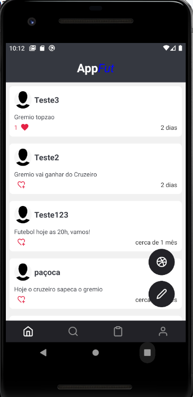
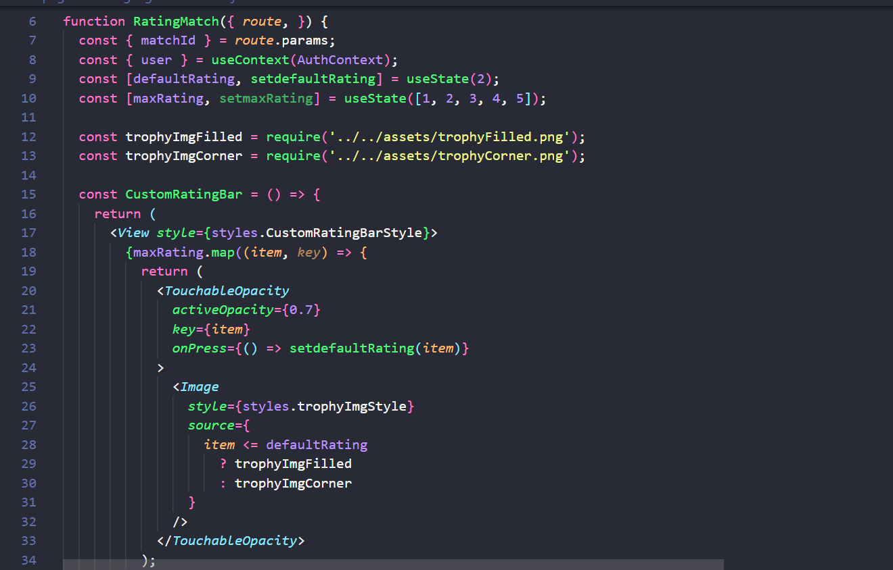

# Programação de Funcionalidades

Nesta seção são apresentadas as implementações iniciais das diversas telas que irão compor o sistema e serão a interface para as diversas funcionalidades do mesmo.

## Sobre o aplicativo 

No aplicativo, encontram-se várias seções distintas, conforme os requisistos funcionais.

O código inclui definições de estilos para os elementos na tela, tais como campos de entrada ("input fields"), botões e cards. Esses estilos são criados utilizando o StyleSheet.create e são aplicados para estilizar os componentes na tela.

O código faz uso do hook useState do React para criar diversos estados. Esses estados incluem "checked" para controlar a seleção, "nome" para armazenar o nome do usuário, "email" para armazenar o e-mail e "senha" para armazenar a senha.

A interface é renderizada dentro de um componente View, composta por dois cards, cada um contendo campos de entrada e botões.

O aplicativo também emprega o useEffect e o useContext para ser configurado de maneira adequada.

No aplicativo desenvolvido em React Native, a gestão de rotas é comumente realizada por meio da biblioteca de navegação React Navigation. Para criar um conjunto de telas e definir a navegação entre elas, utilizamos Navigators, como o Stack Navigator.

Empregamos o hook `useNavigation` para acessar a função `navigate` e direcionar o usuário para outras telas. Para a passagem de parâmetros entre as telas, utilizamos o objeto `route`.

A seguir, apresentamos as telas do aplicativo e uma parte dos artefatos do código.

## RF-001	Permitir que o usuário cadastre-se.

## RF-002	Permitir que o usuário crie sua pelada.

## RF-003	Permitir que o usuário associe-se à uma pelada.

## RF-004	Permitir que o usuário registre os gols da partida.

## RF-005	Permitir que o usuário visualize a lista de presença.

## RF-006	A aplicação deverá ter uma aba de resenha para a galera postar no aplicativo.

## RF-007	A aplicação deverá cronometrar as partidas.

## RF-008	A Aplicação deverá permitir que os usuários avaliem as partidas.

## RF-009	A aplicação deverá informar aos semimensalistas e avulsos a chave PIX para pagamento e RF-010	A aplicação deverá permitir aos semimensalistas e avulsos informar o pagamento realizado.

